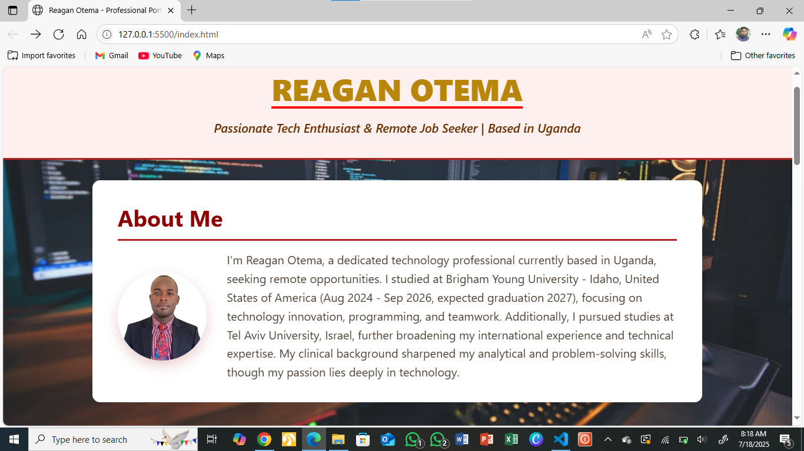
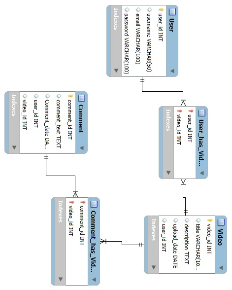
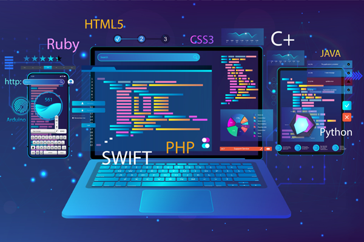
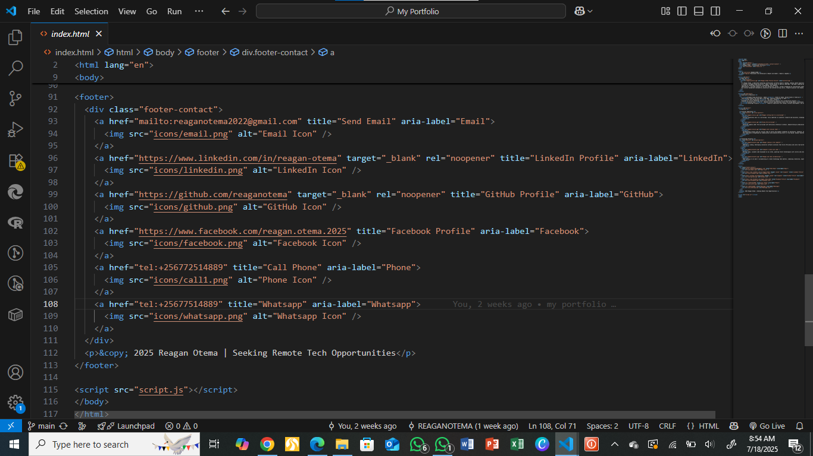
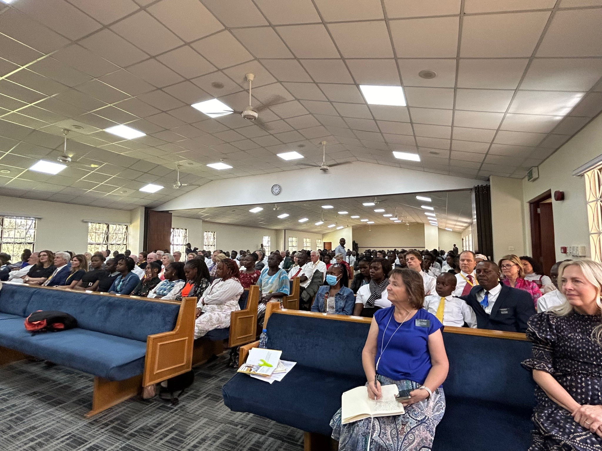

<!-- 🚩 Banner Image (Hero Style) -->

  

# 👋🏽 Hey, I'm Reagan Otema

✨ Developer of Ideas. Architect of Code.  
🌍 Based in Uganda, Collaborating Across the Globe  
🎓 Software Developer @ **Brigham Young University–Idaho** (2024–2027)  
🚀 Remote-Ready · Full Stack Mastermind · UI/UX Obsessed

---

## 🧭 About Me

I’m not just a student of code — I’m a builder of digital experiences.

Currently pursuing a degree in **Software Development** at **BYU–Idaho**, I work at the intersection of **design, logic, and purpose**. Whether I’m writing clean APIs or crafting beautiful interfaces, I’m driven by one goal:

> _To create software that feels invisible — intuitive, powerful, and built to last.

---

## 🌟 Featured Projects

### 💼 Portfolio Website — Where My Code Meets My Craft

  

📂 Stack: HTML, CSS, JavaScript  
🎯 100% Responsive, Animated, and SEO-Ready  
🎨 Subtle 3D effects · Smooth transitions · Dynamic galleries  
🔗 [Live Demo](https://reaganotema.github.io/portfolio-site)

---

### 🧪 Task Manager — Built for Focus, Designed for Flow

  

✅ Create, edit, prioritize — with full CRUD functionality  
📊 Interactive dashboards powered by real-time data  
⚙️ React · Node.js · MySQL for bulletproof performance

---

### 💻 Team Collaboration Platform — Agile, Real-Time, Scalable

  

🤝 Real-time messaging · Project boards · Team roles  
🧠 Designed for Agile and async workflows  
🔧 Built with Vue.js · Firebase · Tailwind CSS

---

## 🔥 What I Bring to the Table

### 🧑‍💻 Web Fundamentals

Before the frameworks, there's the craft and I’ve mastered it.  
From **semantic HTML5** to **flexible CSS3** to **powerful vanilla JavaScript**, I write clean, performant code that adapts to users not the other way around.

---

### 🚀 Full Stack Power

I specialize in **React** and **Vue.js** for frontend magic, with **Node.js**, **Express**, and **SQL/NoSQL** on the backend. Whether it’s building REST APIs, deploying with Docker, or integrating third-party services  I engineer systems that scale.

---

## 🧰 My Developer Arsenal

| Frontend           | Backend           | Collaboration & Tools         |
|--------------------|-------------------|-------------------------------|
| HTML5, CSS3, JS    | Node.js, Express  | Git, GitHub, Docker           |
| React, Vue.js      | MySQL, MongoDB    | VS Code, Figma, Slack         |
| Accessibility, UX  | REST APIs         | Agile Scrum, CI/CD Pipelines  |

---

## 🎯 Highlights from the Journey

  
  

  

Each photo captures a moment: deep in code, in sync with a team, or chasing that breakthrough idea.  
**This isn’t just my work — it’s my craft.**

---

## 🌐 Explore My World

🖼️ Dive into the full experience on my portfolio:  
🔗 **[reaganotema.github.io/portfolio-site](https://reaganotema.github.io/portfolio-site)**

• Project galleries  
• UI/UX design demos  
• Technical blogs  
• Mobile-first, always live

---

## 📬 Let’s Connect

  
  
  
  

Let’s talk code, design, or the next big idea.

---

## ✨ Words I Live By

> _“The best way to predict the future is to invent it.”_  
> — Alan Kay

---

<!-- 👤 Profile Picture -->

  

<i>Thanks for stopping by, I don’t just build software. I build futures.</i>

